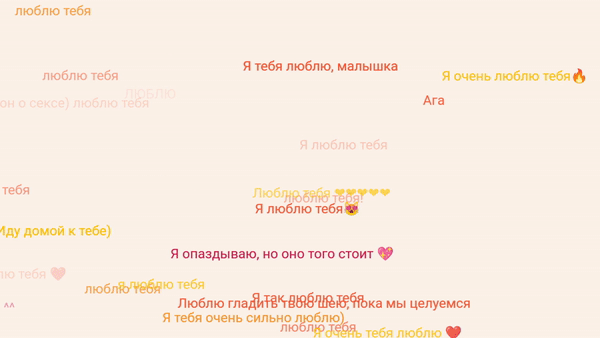

# VK messages parser
Парсит сообщения из вашего архива ВК и создаёт визуализацию



## Как получить все сообщения из переписки одним .txt файлом:
1. Запросите у ВК свой архив переписок. [Инструкция как это сделать](https://vk.com/faq18145)
2. Склонируйте репозиторий к себе на компьютер: 
```
git clone https://github.com/heartmarshall/VK-messages-parser.git
```
3. В архиве вашего профиля ВК можно найти папку `messages`, где каждая переписка вынесена в отдельную папку. Чтобы понять какую именно папку открывать, открываете `index-messages.html` и ищите нужного человека. Перейдя по ссылке, в адресной строке вы увидете что-то типа:
```
file:///home/username/.fr-GZFN5j/messages/-209008242/messages0.html
```
Здесь `-209008242` именно тот номер, который нас интересует, запоминаем его. Находим эту папку в `messages` и переносим её в папку `users`.

4. Откройте ноутбук `get_messages.ipynb` и перейдите к клетке с непосредственно парсингом. Меняем значение переменной `USER` на то название папки, которую вы закинули в `users` и запускаем код. В итоге у вас получится .txt файл со всеми сообщениями вашей переписки.

PS: картинки, вложенные сообщения, видео итд НЕ ПАРСЯТСЯ.

## Как запустить визуализацию

1. Скопируйте полученный .txt файл с нужными вам сообщениями в папку `visualization`.
2. Откройте консоль в папке `visualization`. Запустите http сервер:
```
python -m http.server
```
3. Перейдите по адресу `http://0.0.0.0:8000/` в любом браузере.

